# Dochi Script Dependencies

Generated from `dc_dependencies.json` and package manifests.

- Generated: `2026-05-10T05:37:37.208Z`
- Manifests: `11`
- Files: `29`
- Dependency sets: `10`

## Overview

| Package | MC | Version | Source | Install As | Inherits | Deps | Required | Optional |
|---|---|---:|---|---|---|---:|---:|---:|
| dialogue | common | 1.0.0 | `dc_dialogue_trigger.js` | `dc_dialogue_trigger.js` | `npc_util.dialogue_trigger` | 7 | 7 | 0 |
| item_editor | forge_1_20_1 | 1.0.0 | `dc_item_editor.js` | `dc_item_editor.js` | `item_editor.data` | 4 | 3 | 1 |
| npc_editor | common | 1.0.0 | `dc_npc_editor.html` | `dc_npc_editor.html` | - | 0 | 0 | 0 |
| npc_editor | common | 1.0.0 | `dc_npc_editor.js` | `dc_npc_editor.js` | `npc_editor.runtime` | 4 | 4 | 0 |
| npc_util | common | 1.0.0 | `dc_cfg_checker.js` | `dc_cfg_checker.js` | - | 0 | 0 | 0 |
| npc_util | common | 1.0.0 | `dc_cond_checker.js` | `dc_cond_checker.js` | - | 0 | 0 | 0 |
| npc_util | common | 1.0.0 | `dc_dialogue_trigger.js` | `dc_dialogue_trigger.js` | `npc_util.dialogue_trigger` | 7 | 7 | 0 |
| npc_util | common | 1.0.0 | `dc_dialogue_util.js` | `dc_dialogue_util.js` | `npc_util.dialogue_util` | 5 | 4 | 1 |
| npc_util | common | 1.0.0 | `dc_gecko_util.js` | `dc_gecko_util.js` | `npc_util.gecko` | 1 | 0 | 1 |
| npc_util | common | 1.0.0 | `dc_gui_runtime.html` | `dc_util/dc_gui_runtime.html` | - | 0 | 0 | 0 |
| npc_util | common | 1.0.0 | `dc_gui_runtime.js` | `dc_gui_runtime.js` | `npc_util.gui_runtime` | 4 | 4 | 0 |
| npc_util | common | 1.0.0 | `dc_npc_core_module.js` | `dc_npc_core_module.js` | - | 0 | 0 | 0 |
| npc_util | common | 1.0.0 | `dc_reward_checker.js` | `dc_reward_checker.js` | - | 0 | 0 | 0 |
| npc_util | common | 1.0.0 | `dc_sequence_core.js` | `dc_sequence_core.js` | - | 0 | 0 | 0 |
| npc_util | common | 1.0.0 | `dc_sound.html` | `dc_util/dc_sound.html` | - | 0 | 0 | 0 |
| npc_util | common | 1.0.0 | `dc_util_common.js` | `dc_util_common.js` | `npc_util.util_common` | 1 | 0 | 1 |
| scroll_dialogue | common | 1.0.0 | `dc_story_scroll.js` | `dc_story_scroll.js` | `scroll_dialogue.data` | 2 | 2 | 0 |
| soullikemob | forge_1_20_1 | 1.0.0 | `dc_soullikemob.html` | `dc_soullikemob.html` | - | 0 | 0 | 0 |
| soullikemob | forge_1_20_1 | 1.0.0 | `dc_soullikemob.js` | `dc_soullikemob.js` | `soullikemob.html` | 1 | 1 | 0 |
| soullikemob | forge_1_20_1 | 1.0.1 | `dc_soullikemob.html` | `dc_soullikemob.html` | - | 0 | 0 | 0 |
| soullikemob | forge_1_20_1 | 1.0.1 | `dc_soullikemob.js` | `dc_soullikemob.js` | `soullikemob.html` | 1 | 1 | 0 |
| soullikemob | forge_1_20_1 | 1.0.2 | `dc_soullikemob.html` | `dc_soullikemob.html` | - | 0 | 0 | 0 |
| soullikemob | forge_1_20_1 | 1.0.2 | `dc_soullikemob.js` | `dc_soullikemob.js` | `soullikemob.html` | 1 | 1 | 0 |
| trainer | fabric_1_21_1 | 1.0.0 | `dc_trainer.html` | `dc_trainer.html` | - | 0 | 0 | 0 |
| trainer | fabric_1_21_1 | 1.0.0 | `dc_trainer.js` | `dc_trainer.js` | `trainer.html` | 1 | 1 | 0 |
| trainer | fabric_1_21_1 | 1.0.1 | `dc_trainer.html` | `dc_trainer.html` | - | 0 | 0 | 0 |
| trainer | fabric_1_21_1 | 1.0.1 | `dc_trainer.js` | `dc_trainer.js` | `trainer.html` | 1 | 1 | 0 |
| trainer | fabric_1_21_1 | 1.0.2 | `dc_trainer.html` | `dc_trainer.html` | - | 0 | 0 | 0 |
| trainer | fabric_1_21_1 | 1.0.2 | `dc_trainer.js` | `dc_trainer.js` | `trainer.html` | 1 | 1 | 0 |

## Dependency Sets

| Set | Description | Dependencies |
|---|---|---:|
| `item_editor.data` | Item editor JSON save/load roots and config files. | 4 |
| `npc_editor.runtime` | Dependencies used by the NPC editor HTML GUI and script browser. | 4 |
| `npc_util.dialogue_trigger` | Full dependency chain needed by dc_dialogue_trigger.js. | 7 |
| `npc_util.dialogue_util` | Dependencies needed by dc_dialogue_util.js. | 5 |
| `npc_util.gecko` | Optional Gecko animation integration. | 1 |
| `npc_util.gui_runtime` | Script and HTML dependencies needed by dc_gui_runtime.js. | 4 |
| `npc_util.util_common` | Optional HTML sound overlay used by dc_util_common.js. | 1 |
| `scroll_dialogue.data` | Legacy scroll dialogue JSON input directory. | 2 |
| `soullikemob.html` | Soullikemob HTML mount dependency. | 1 |
| `trainer.html` | Trainer HTML mount dependency. | 1 |

## Graph

```mermaid
flowchart LR
  n0["dc_dialogue_trigger.js"] --> n1["npc_util.dialogue_trigger"]
  n1["npc_util.dialogue_trigger"] --> n2["dc_lib/ds_npc_util/dc_npc_core_module.js"]
  n1["npc_util.dialogue_trigger"] --> n3["dc_lib/ds_npc_util/dc_cfg_checker.js"]
  n1["npc_util.dialogue_trigger"] --> n4["dc_lib/ds_npc_util/dc_util_common.js"]
  n1["npc_util.dialogue_trigger"] --> n5["dc_lib/ds_npc_util/dc_gui_runtime.js"]
  n1["npc_util.dialogue_trigger"] --> n6["dc_lib/ds_npc_util/dc_dialogue_util.js"]
  n1["npc_util.dialogue_trigger"] --> n7["html/dc_util/dc_gui_runtime.html"]
  n1["npc_util.dialogue_trigger"] --> n8["customnpcs/dc_data/dc_dialogues/"]
  n9["dc_item_editor.js"] --> n10["item_editor.data"]
  n10["item_editor.data"] --> n11["customnpcs/JSON/item/"]
  n10["item_editor.data"] --> n12["customnpcs/JSON/item/prefix/"]
  n10["item_editor.data"] --> n13["customnpcs/JSON/item/category_config.json"]
  n10["item_editor.data"] --> n14["customnpcs/JSON/item/category_presets/"]
  n15["dc_npc_editor.js"] --> n16["npc_editor.runtime"]
  n16["npc_editor.runtime"] --> n17["CNPCExtended"]
  n16["npc_editor.runtime"] --> n18["html/dc_npc_editor.html"]
  n16["npc_editor.runtime"] --> n19["customnpcs/scripts/ecmascript/"]
  n16["npc_editor.runtime"] --> n20["customnpcs/dc_admins/"]
  n21["dc_util_common.js"] --> n22["npc_util.util_common"]
  n22["npc_util.util_common"] --> n23["html/dc_util/dc_sound.html"]
  n24["dc_gecko_util.js"] --> n25["npc_util.gecko"]
  n25["npc_util.gecko"] --> n26["CNPC-Gecko"]
  n27["dc_gui_runtime.js"] --> n28["npc_util.gui_runtime"]
  n28["npc_util.gui_runtime"] --> n3["dc_lib/ds_npc_util/dc_cfg_checker.js"]
  n28["npc_util.gui_runtime"] --> n4["dc_lib/ds_npc_util/dc_util_common.js"]
  n28["npc_util.gui_runtime"] --> n17["CNPCExtended"]
  n28["npc_util.gui_runtime"] --> n7["html/dc_util/dc_gui_runtime.html"]
  n29["dc_dialogue_util.js"] --> n30["npc_util.dialogue_util"]
  n30["npc_util.dialogue_util"] --> n3["dc_lib/ds_npc_util/dc_cfg_checker.js"]
  n30["npc_util.dialogue_util"] --> n5["dc_lib/ds_npc_util/dc_gui_runtime.js"]
  n30["npc_util.dialogue_util"] --> n31["dc_lib/ds_npc_util/dc_gecko_util.js"]
  n30["npc_util.dialogue_util"] --> n32["customnpcs/dc_data/dc_gui/dialogue_gui.json"]
  n30["npc_util.dialogue_util"] --> n8["customnpcs/dc_data/dc_dialogues/"]
  n33["dc_dialogue_trigger.js"] --> n1["npc_util.dialogue_trigger"]
  n34["dc_story_scroll.js"] --> n35["scroll_dialogue.data"]
  n35["scroll_dialogue.data"] --> n36["customnpcs/JSON/npc_dialogue/"]
  n35["scroll_dialogue.data"] --> n37["customnpcs/JSON/npc_dialogue/&lt;npc_name&gt;.json"]
  n38["dc_soullikemob.js"] --> n39["soullikemob.html"]
  n39["soullikemob.html"] --> n40["html/dc_soullikemob.html"]
  n41["dc_soullikemob.js"] --> n39["soullikemob.html"]
  n42["dc_soullikemob.js"] --> n39["soullikemob.html"]
  n43["dc_trainer.js"] --> n44["trainer.html"]
  n44["trainer.html"] --> n45["html/dc_trainer.html"]
  n46["dc_trainer.js"] --> n44["trainer.html"]
  n47["dc_trainer.js"] --> n44["trainer.html"]
  classDef script fill:#e8f2ff,stroke:#376b9f,color:#14273a
  classDef set fill:#fff5dc,stroke:#ad7d17,color:#3b2a05
  classDef html fill:#e7f8ef,stroke:#2c8a54,color:#0d3320
  classDef mod fill:#fdecec,stroke:#b34b4b,color:#4a1515
  classDef data fill:#f0edff,stroke:#6f58b8,color:#241b4a
  class n0 script
  class n1 set
  class n2 script
  class n3 script
  class n4 script
  class n5 script
  class n6 script
  class n7 html
  class n8 data
  class n9 script
  class n10 set
  class n11 data
  class n12 data
  class n13 data
  class n14 data
  class n15 script
  class n16 set
  class n17 mod
  class n18 html
  class n19 data
  class n20 data
  class n21 script
  class n22 set
  class n23 html
  class n24 script
  class n25 set
  class n26 mod
  class n27 script
  class n28 set
  class n29 script
  class n30 set
  class n31 script
  class n32 data
  class n33 script
  class n34 script
  class n35 set
  class n36 data
  class n37 data
  class n38 script
  class n39 set
  class n40 html
  class n41 script
  class n42 script
  class n43 script
  class n44 set
  class n45 html
  class n46 script
  class n47 script
```

## Expanded Dependencies

### dialogue 1.0.0 - `dc_dialogue_trigger.js`

| Type | Target | Required | Load Order | Inherited From | Note |
|---|---|---|---:|---|---|
| script | `dc_lib/ds_npc_util/dc_npc_core_module.js` | yes | 1 | `npc_util.dialogue_trigger` |  |
| script | `dc_lib/ds_npc_util/dc_cfg_checker.js` | yes | 2 | `npc_util.dialogue_trigger` |  |
| script | `dc_lib/ds_npc_util/dc_util_common.js` | yes | 3 | `npc_util.dialogue_trigger` |  |
| script | `dc_lib/ds_npc_util/dc_gui_runtime.js` | yes | 4 | `npc_util.dialogue_trigger` |  |
| script | `dc_lib/ds_npc_util/dc_dialogue_util.js` | yes | 5 | `npc_util.dialogue_trigger` |  |
| html | `html/dc_util/dc_gui_runtime.html` | yes |  | `npc_util.dialogue_trigger` |  |
| json_dir | `customnpcs/dc_data/dc_dialogues/` | yes |  | `npc_util.dialogue_trigger` | dialogueJsonPath resolves here unless a customnpcs/dc_data path is supplied. |

### item_editor 1.0.0 - `dc_item_editor.js`

| Type | Target | Required | Load Order | Inherited From | Note |
|---|---|---|---:|---|---|
| json_dir | `customnpcs/JSON/item/` | yes |  | `item_editor.data` | Default item JSON save/load root. |
| json_dir | `customnpcs/JSON/item/prefix/` | yes |  | `item_editor.data` | Default prefix preset directory. |
| json | `customnpcs/JSON/item/category_config.json` | yes |  | `item_editor.data` | Category configuration file created/read by the editor. |
| json_dir | `customnpcs/JSON/item/category_presets/` | no |  | `item_editor.data` | Optional category preset directory used by preset import/export. |

### npc_editor 1.0.0 - `dc_npc_editor.js`

| Type | Target | Required | Load Order | Inherited From | Note |
|---|---|---|---:|---|---|
| mod | `CNPCExtended` | yes |  | `npc_editor.runtime` | Required for HTML GUI and browser bridge calls. |
| html | `html/dc_npc_editor.html` | yes |  | `npc_editor.runtime` |  |
| directory | `customnpcs/scripts/ecmascript/` | yes |  | `npc_editor.runtime` | Scans installed ECMAScript and dc_lib scripts. |
| directory | `customnpcs/dc_admins/` | yes |  | `npc_editor.runtime` | Stores and reads NPC editor admin access data. |

### npc_util 1.0.0 - `dc_dialogue_trigger.js`

| Type | Target | Required | Load Order | Inherited From | Note |
|---|---|---|---:|---|---|
| script | `dc_lib/ds_npc_util/dc_npc_core_module.js` | yes | 1 | `npc_util.dialogue_trigger` |  |
| script | `dc_lib/ds_npc_util/dc_cfg_checker.js` | yes | 2 | `npc_util.dialogue_trigger` |  |
| script | `dc_lib/ds_npc_util/dc_util_common.js` | yes | 3 | `npc_util.dialogue_trigger` |  |
| script | `dc_lib/ds_npc_util/dc_gui_runtime.js` | yes | 4 | `npc_util.dialogue_trigger` |  |
| script | `dc_lib/ds_npc_util/dc_dialogue_util.js` | yes | 5 | `npc_util.dialogue_trigger` |  |
| html | `html/dc_util/dc_gui_runtime.html` | yes |  | `npc_util.dialogue_trigger` |  |
| json_dir | `customnpcs/dc_data/dc_dialogues/` | yes |  | `npc_util.dialogue_trigger` | dialogueJsonPath resolves here unless a customnpcs/dc_data path is supplied. |

### npc_util 1.0.0 - `dc_dialogue_util.js`

| Type | Target | Required | Load Order | Inherited From | Note |
|---|---|---|---:|---|---|
| script | `dc_lib/ds_npc_util/dc_cfg_checker.js` | yes | 2 | `npc_util.dialogue_util` |  |
| script | `dc_lib/ds_npc_util/dc_gui_runtime.js` | yes | 4 | `npc_util.dialogue_util` |  |
| script | `dc_lib/ds_npc_util/dc_gecko_util.js` | no |  | `npc_util.dialogue_util` | Only needed when NPC FX uses Gecko skin/model/animation calls. |
| json | `customnpcs/dc_data/dc_gui/dialogue_gui.json` | yes |  | `npc_util.dialogue_util` | Default GUI template when guiJsonPath is empty. |
| json_dir | `customnpcs/dc_data/dc_dialogues/` | yes |  | `npc_util.dialogue_util` | dialogueJsonPath resolves here unless a customnpcs/dc_data path is supplied. |

### npc_util 1.0.0 - `dc_gecko_util.js`

| Type | Target | Required | Load Order | Inherited From | Note |
|---|---|---|---:|---|---|
| mod | `CNPC-Gecko` | no |  | `npc_util.gecko` | Only needed when NPC FX uses Gecko skin/model/animation calls. |

### npc_util 1.0.0 - `dc_gui_runtime.js`

| Type | Target | Required | Load Order | Inherited From | Note |
|---|---|---|---:|---|---|
| script | `dc_lib/ds_npc_util/dc_cfg_checker.js` | yes | 2 | `npc_util.gui_runtime` |  |
| script | `dc_lib/ds_npc_util/dc_util_common.js` | yes | 3 | `npc_util.gui_runtime` |  |
| mod | `CNPCExtended` | yes |  | `npc_util.gui_runtime` | Required for HTML GUI and browser bridge calls. |
| html | `html/dc_util/dc_gui_runtime.html` | yes |  | `npc_util.gui_runtime` |  |

### npc_util 1.0.0 - `dc_util_common.js`

| Type | Target | Required | Load Order | Inherited From | Note |
|---|---|---|---:|---|---|
| html | `html/dc_util/dc_sound.html` | no |  | `npc_util.util_common` | Required only for util_sound html/overlay mode. |

### scroll_dialogue 1.0.0 - `dc_story_scroll.js`

| Type | Target | Required | Load Order | Inherited From | Note |
|---|---|---|---:|---|---|
| json_dir | `customnpcs/JSON/npc_dialogue/` | yes |  | `scroll_dialogue.data` | Reads <npc_name>.json from this directory. |
| json | `customnpcs/JSON/npc_dialogue/<npc_name>.json` | yes |  | `scroll_dialogue.data` | Runtime dialogue file name is derived from the NPC name. |

### soullikemob 1.0.0 - `dc_soullikemob.js`

| Type | Target | Required | Load Order | Inherited From | Note |
|---|---|---|---:|---|---|
| html | `html/dc_soullikemob.html` | yes |  | `soullikemob.html` | DOM mount target is supplied by dc_soullikemob.html. |

### soullikemob 1.0.1 - `dc_soullikemob.js`

| Type | Target | Required | Load Order | Inherited From | Note |
|---|---|---|---:|---|---|
| html | `html/dc_soullikemob.html` | yes |  | `soullikemob.html` | DOM mount target is supplied by dc_soullikemob.html. |

### soullikemob 1.0.2 - `dc_soullikemob.js`

| Type | Target | Required | Load Order | Inherited From | Note |
|---|---|---|---:|---|---|
| html | `html/dc_soullikemob.html` | yes |  | `soullikemob.html` | DOM mount target is supplied by dc_soullikemob.html. |

### trainer 1.0.0 - `dc_trainer.js`

| Type | Target | Required | Load Order | Inherited From | Note |
|---|---|---|---:|---|---|
| html | `html/dc_trainer.html` | yes |  | `trainer.html` | DOM mount target is supplied by dc_trainer.html. |

### trainer 1.0.1 - `dc_trainer.js`

| Type | Target | Required | Load Order | Inherited From | Note |
|---|---|---|---:|---|---|
| html | `html/dc_trainer.html` | yes |  | `trainer.html` | DOM mount target is supplied by dc_trainer.html. |

### trainer 1.0.2 - `dc_trainer.js`

| Type | Target | Required | Load Order | Inherited From | Note |
|---|---|---|---:|---|---|
| html | `html/dc_trainer.html` | yes |  | `trainer.html` | DOM mount target is supplied by dc_trainer.html. |

