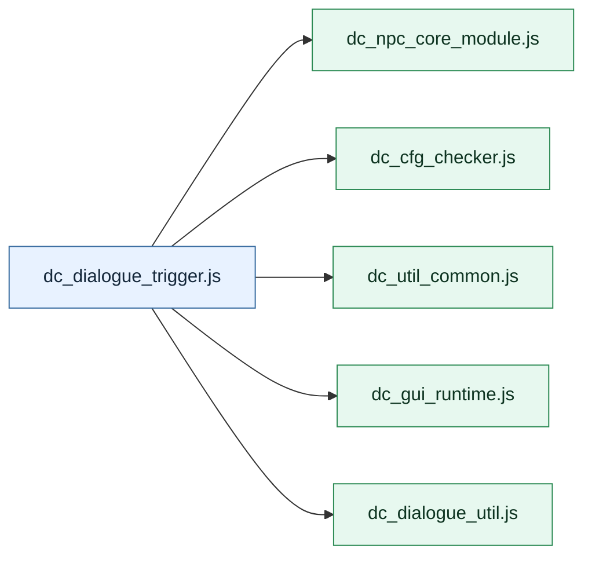

# Dochi Main Scripts

Generated from `dc_main_scripts.json`.

- Generated: `2026-05-10T05:55:02.168Z`
- Utility root: `npc_util/common/1.0.0`
- Main scripts: `6`

## Main List

| Main Script | Package | Versions | Attached Utilities | Attachments | Role |
|---|---|---|---|---|---|
| `dc_dialogue_trigger.js` | dialogue | common 1.0.0 | `dc_npc_core_module.js` `dc_cfg_checker.js` `dc_util_common.js` `dc_gui_runtime.js` `dc_dialogue_util.js` | html: `html/dc_util/dc_gui_runtime.html` json_dir: `customnpcs/dc_data/dc_dialogues/` | Runs dialogue trigger logic and opens the shared dialogue runtime. |
| `dc_item_editor.js` | item_editor | forge_1_20_1 1.0.0 | - | json_dir: `customnpcs/JSON/item/` json_dir: `customnpcs/JSON/item/prefix/` json: `customnpcs/JSON/item/category_config.json` | Standalone item JSON editor. |
| `dc_npc_editor.js` | npc_editor | common 1.0.0 | - | mod: `CNPCExtended` html: `html/dc_npc_editor.html` directory: `customnpcs/scripts/ecmascript/` directory: `customnpcs/dc_admins/` | Standalone NPC browser/editor HTML GUI. |
| `dc_story_scroll.js` | scroll_dialogue | common 1.0.0 | - | json_dir: `customnpcs/JSON/npc_dialogue/` | Standalone CustomNPCs scroll dialogue GUI. |
| `dc_soullikemob.js` | soullikemob | forge_1_20_1 1.0.0 forge_1_20_1 1.0.1 forge_1_20_1 1.0.2 | - | html: `html/dc_soullikemob.html` | HTML-backed Soullikemob package sample. |
| `dc_trainer.js` | trainer | fabric_1_21_1 1.0.0 fabric_1_21_1 1.0.1 fabric_1_21_1 1.0.2 | - | html: `html/dc_trainer.html` | HTML-backed Trainer package sample. |

## Utility Map

## Details

### `dc_dialogue_trigger.js`

Runs dialogue trigger logic and opens the shared dialogue runtime.

| Utility Script | Required | Load Order | Role |
|---|---|---:|---|
| `dc_npc_core_module.js` | yes | 1 | Core NPC/module helpers. |
| `dc_cfg_checker.js` | yes | 2 | Config validation helpers. |
| `dc_util_common.js` | yes | 3 | Shared utility helpers. |
| `dc_gui_runtime.js` | yes | 4 | Shared HTML GUI bridge/runtime. |
| `dc_dialogue_util.js` | yes | 5 | Dialogue data loading and rendering helpers. |

### `dc_item_editor.js`

Standalone item JSON editor.

| Utility Script | Required | Load Order | Role |
|---|---|---:|---|
| - | - | - | No utility script attachment. |

### `dc_npc_editor.js`

Standalone NPC browser/editor HTML GUI.

| Utility Script | Required | Load Order | Role |
|---|---|---:|---|
| - | - | - | No utility script attachment. |

### `dc_story_scroll.js`

Standalone CustomNPCs scroll dialogue GUI.

| Utility Script | Required | Load Order | Role |
|---|---|---:|---|
| - | - | - | No utility script attachment. |

### `dc_soullikemob.js`

HTML-backed Soullikemob package sample.

| Utility Script | Required | Load Order | Role |
|---|---|---:|---|
| - | - | - | No utility script attachment. |

### `dc_trainer.js`

HTML-backed Trainer package sample.

| Utility Script | Required | Load Order | Role |
|---|---|---:|---|
| - | - | - | No utility script attachment. |

